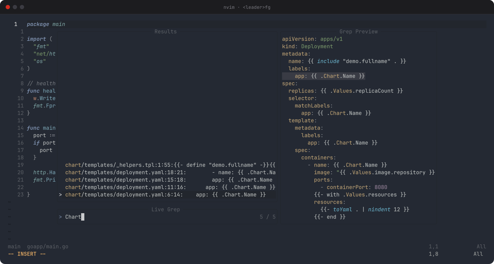

# CustomNeoVim12Config

My Neovim config, rebuilt for **Neovim 0.12**. It leans on what the editor now does by itself: the built-in plugin manager (`vim.pack`), built-in completion, `vim.lsp.enable()`, the undo tree. Plugins only come in where they genuinely do it better. Eight plugins, about 550 lines of Lua, no plugin-manager bootstrap, no Mason UI.

The story behind it (and the headaches) is on my blog: [RattleSploitable](https://rattlesploitable.blogspot.com/).



## What's inside

| Plugin | What for |
|---|---|
| [kanso.nvim](https://github.com/webhooked/kanso.nvim) | Colorscheme (transparent, saturated, with my own highlight tweaks) |
| [nvim-lspconfig](https://github.com/neovim/nvim-lspconfig) | Ready-made language server configs, used through `vim.lsp.enable()` |
| [nvim-treesitter](https://github.com/nvim-treesitter/nvim-treesitter) (`main` branch) | Parsers for highlighting, folding and indentation |
| [telescope.nvim](https://github.com/nvim-telescope/telescope.nvim) + [plenary.nvim](https://github.com/nvim-lua/plenary.nvim) | Fuzzy finder popup with preview |
| [nvim-tree.lua](https://github.com/nvim-tree/nvim-tree.lua) + [nvim-web-devicons](https://github.com/nvim-tree/nvim-web-devicons) | File tree sidebar with icons |
| [nvim-autopairs](https://github.com/windwp/nvim-autopairs) | Auto-close brackets and quotes |

Everything else is Neovim itself, plus a bit of Lua:

- **Plugin management:** `vim.pack`, with versions pinned in `nvim-pack-lock.json`.
- **Completion:** the 0.12 `'autocomplete'` option plus LSP completion. The menu pops up as you type, `<Tab>` picks an item, `<Enter>` only accepts what you picked, and `<C-Space>` opens the menu on demand. No nvim-cmp.
- **LSP:** gopls, pyright, clangd, jdtls, zls, asm-lsp, rust-analyzer, terraform-ls, helm-ls and yaml-language-server. Each one is enabled **only if it's installed**, so missing servers never nag you. Servers installed with Mason are picked up from `~/.local/share/nvim/mason/bin`, without the Mason plugin.
- **Git blame:** inline, toggled with `<leader>gb`. It's native, with no plugin, and blames unsaved edits too.
- **Statusline:** Neovim's default one, plus the current Git branch.
- **Diagnostics:** quiet by default (just a gutter sign and an underline). `<leader>d` toggles full virtual-line messages.
- **Helm:** chart templates are detected as `helm` files without vim-helm.
- **Treesitter:** parsers for new languages install automatically the first time you open one.
- **Built-in extras:** `:Undotree`, `:DiffTool`, and `:restart` to reload after config changes.

## Requirements

- **Neovim 0.12 or newer** (the installer checks this)
- `git` (required, `vim.pack` uses it)
- `tree-sitter-cli` and a C compiler, to build parsers (install the CLI from your package manager, not npm)
- `ripgrep`, for Telescope live grep
- A [Nerd Font](https://www.nerdfonts.com/) in your terminal, for the icons
- Whichever language servers you want

On Arch:

```bash
sudo pacman -S neovim git gcc tree-sitter-cli ripgrep \
               gopls pyright clang rust-analyzer yaml-language-server
yay -S terraform-ls helm-ls-bin jdtls   # optional, from the AUR
```

## Install

```bash
git clone https://github.com/Rattle-Brain/CustomNeoVim12Config.git
cd CustomNeoVim12Config
./install.sh
```

The installer:

1. checks for Neovim 0.12+ and git, and warns about missing optional tools;
2. backs up your current `~/.config/nvim` to `~/.config/nvim-old-config.tar.gz` (if that file already exists, the new backup gets a timestamp, so nothing is overwritten);
3. copies this config into `~/.config/nvim`;
4. installs the plugins once in the background, so the first launch is clean.

Changed your mind? Restore the old config with:

```bash
rm -rf ~/.config/nvim && tar -xzf ~/.config/nvim-old-config.tar.gz -C ~/.config
```

## Keymaps

The leader key is <kbd>Space</kbd>.

| Keys | Action |
|---|---|
| `<leader>ff` / `<leader>fg` / `<leader>fd` | Find files / search in files / all diagnostics (Telescope) |
| `<leader>n` | Toggle the file tree (`<leader>n+` / `<leader>n-` resize it) |
| `<leader>e` | Reveal the current file in the tree |
| `<leader>gb` | Toggle inline git blame |
| `<leader>d` | Toggle diagnostic virtual lines |
| `<leader>u` | Undo tree |
| `<leader>lf` | Format the buffer |
| `gd` `gD` `gi` `gt` `gr` | Definition, declaration, implementation, type definition, references |
| `gp` | Peek a definition in a floating window |
| `K` / `<C-s>` | Hover docs / signature help |
| `<leader>ca` / `<leader>rn` | Code action / rename |
| `<leader>ds` / `<leader>ws` / `<leader>fr` | Document symbols / workspace symbols / references |
| `<leader>ih` | Toggle inlay hints |
| `]d` / `[d`, `<C-w>d` | Next / previous diagnostic, diagnostic float |
| `<leader>tn` `tc` `tl` `th` | New / close / next / previous tab |
| `<leader>te` / `<leader>tq` | Open terminal / leave terminal |
| `<leader>w` `q` `wq` `qa` `qq` | Save all, quit, save and quit, quit all, force quit |
| `<C-h/j/k/l>` | Move between windows |

In insert mode: `<Tab>`/`<S-Tab>` move through the completion menu (or jump through snippet fields), `<Enter>` accepts the selected item, and `<C-Space>` opens the menu. In Telescope, `<C-j>`/`<C-k>` move through results.

## Layout

```
init.lua            entry point: loads the modules below in order
lua/options.lua     editor options and diagnostics settings
lua/plugins.lua     vim.pack plugin list + plugin setup (theme, tree, telescope)
lua/lsp.lua         which servers to enable, Helm detection, LSP keymaps
lua/completion.lua  autocomplete, Tab/Enter/C-Space behaviour, cmdline completion
lua/treesitter.lua  parsers, highlighting, folding, auto-install
lua/git.lua         inline blame and the branch in the statusline
lua/keymaps.lua     everything else
after/lsp/*.lua     per-server settings (jdtls, gopls, yamlls, zls...)
```

## Updating

```vim
:lua vim.pack.update()
```

Review the changes in the tab that opens, `:w` to apply them, then `:restart`.

## License

MIT. Steal it, break it, make it yours.
